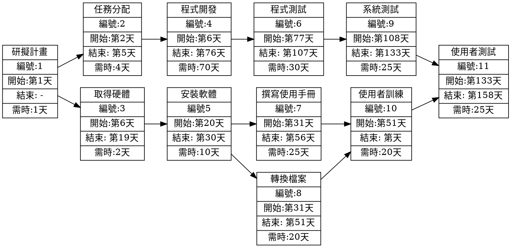

工作分解結構清單列出了 11 項任務，每項任務都有編號、說明、需時，以及前置任務。
其中，某些依存任務可以擁有一個或多個前置任務。
請以(1)PERT/CPM 圖和(2)甘特圖以及(3)關鍵路徑來表示這些任務。
你必須進行兩個步驟：

(1) 顯示任務及任務模式。

(2) 輸入開始及結束時間。

| 任務 | 說明         | 需時(天) | 前置任務 |
| ---- | ------------ | -------- | -------- |
| 1    | 研擬計畫     | 1        | -        |
| 2    | 任務分配     | 4        | 1        |
| 3    | 取得硬體     | 17       | 1        |
| 4    | 程式開發     | 70       | 2        |
| 5    | 安裝軟體     | 10       | 3        |
| 6    | 程式測試     | 30       | 4        |
| 7    | 撰寫使用手冊 | 25       | 5        |
| 8    | 轉換檔案     | 20       | 5        |
| 9    | 系統測試     | 25       | 6        |
| 10   | 使用者訓練   | 20       | 7,8      |
| 11   | 使用者測試   | 25       | 9,10     |

**(1) PERT/CPM 圖**



**(2) 甘特圖**

```mermaid
gantt
    title 第九組小組作業甘特圖

    1.研擬計畫		: a1, ,1d
    2.任務分配		: a2 , after a1  , 4d
    3.取得硬體		:a3 , after a2  , 17d
    4.程式開發		:a4, after a3, 70d
    5.安裝軟體		:a5, after a4, 10d
    6.程式測試		:a6, after a5  , 30d
    7.撰寫使用手冊  :a7,after a6 , 25d
    8.轉換檔案      :a8 ,after a7, 20d
    9.系統測試      :a9 ,after a8, 25d
    10.使用者訓練	:a10,after a9, 20d
    11.使用者測試	: a10, after a10 , 25d
```

**(3)關鍵路徑**

Footer
© 2022 GitHub, Inc.
Footer navigation
Terms
Privacy
Security
